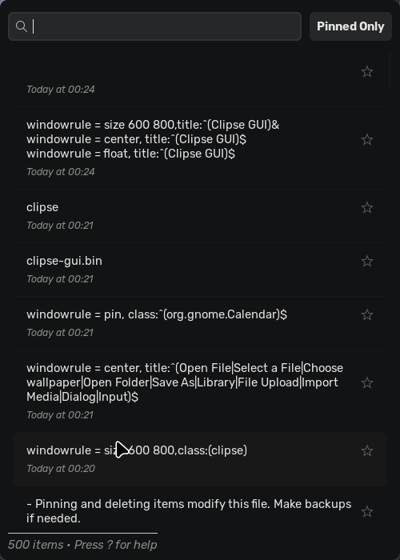

# Clipse GUI

A GTK3 graphical user interface for the excellent [clipse](https://github.com/savedra1/clipse) command-line clipboard manager by savedra1.

This GUI provides a visual way to browse, search, pin, preview, and copy items from your `clipse` clipboard history.



## Features

- **Visual History:** Browse your clipboard history in a scrollable list.
- **Lazy Loading:** Efficiently loads history items as you scroll.
- **Search:** Quickly filter history items by typing.
- **Pinning:** Pin important items to keep them accessible.
- **Filtering:** Toggle to show only pinned items.
- **Preview:**
  - Image thumbnails directly in the list.
  - Larger preview window for both text and images.
  - Zoom controls for text previews.
- **Copying:** Easily copy any item back to the clipboard (Enter key or double-click).
- **Keyboard Navigation:** Navigate the list, search, pin, delete, preview, and copy using keyboard shortcuts (press `?` in-app for details).
- **Zoom:** Adjust the main list's font size (Ctrl+Plus, Ctrl+Minus, Ctrl+0).
- **Desktop Entry:** Provides an application menu entry when installed.

## Dependencies

### User Dependencies (Required to Run)

1.  **`clipse` CLI Tool:**
    - **This is essential.** `clipse-gui` reads the history file generated by the base `clipse` tool.
    - Install `clipse` from: [https://github.com/savedra1/clipse](https://github.com/savedra1/clipse)
    - Ensure the `clipse` daemon/service is running and collecting history to `~/.config/clipse/clipboard_history.json`.
2.  **GTK3 Libraries & Dependencies:** The core GTK+ 3 runtime libraries and their dependencies (GLib, GDK, Pango, GdkPixbuf, Cairo, GObject Introspection data, etc.). These are typically pre-installed or easily installed via your system package manager.
    - _Debian/Ubuntu:_ `sudo apt install libgtk-3-0 gir1.2-gtk-3.0 libcairo2 libgdk-pixbuf2.0-0` (most are usually installed)
    - _Fedora/RHEL:_ `sudo dnf install gtk3 cairo gdk-pixbuf2` (usually installed)
    - _Arch Linux:_ `sudo pacman -Syu gtk3 cairo gdk-pixbuf2` (usually installed)

### Build/Install Dependencies (Only if Building from Source)

1.  **Python 3:** Version 3.8+ recommended (developed with 3.13).
2.  **Pip:** Python's package installer.
3.  **Python Development Headers:** Often needed for Nuitka compilation.
    - _Debian/Ubuntu:_ `sudo apt install python3-dev`
    - _Fedora/RHEL:_ `sudo dnf install python3-devel`
    - _Arch Linux:_ (Usually included with `python`)
4.  **PyGObject & Cairo Bindings:** Required to run the Python code _and_ for Nuitka to compile correctly.
    - _Debian/Ubuntu:_ `sudo apt install python3-gi python3-gi-cairo gir1.2-gtk-3.0`
    - _Fedora/RHEL:_ `sudo dnf install python3-gobject gtk3`
    - _Arch Linux:_ `sudo pacman -Syu python-gobject gtk3`
5.  **Nuitka & Build Tools:** Required to compile using `make nuitka` or `make install`.
    - A C Compiler like GCC (`build-essential`, `Development Tools`, `base-devel`).
    - Nuitka: `pip install nuitka`
6.  **`make`:** Required to use the `Makefile` targets.

## Installation & Running

Choose the method that best suits you:

### Option 1: Build and Install from Source

This compiles the Python code to a native executable using Nuitka and installs it system-wide (typically to `/usr/local`). Best if you want the latest code or need to build for your specific architecture.

1.  **Install ALL Dependencies:** Make sure you have installed the **User Dependencies** AND the **Build/Install Dependencies** listed above using `pip` and your system package manager.
2.  **Get Source Code:**
    ```bash
    git clone https://github.com/d7omdev/clipse-gui
    cd clipse-gui
    ```
3.  **Compile and Install:**

    ```bash
    make install
    ```

    - This command runs `make nuitka` first to compile the application (this **can take several minutes**).
    - Then, it installs the compiled application, icon, and desktop file.
    - You will be prompted for your `sudo` password for the installation steps.

4.  **Run:** After installation, run `clipse-gui` from your terminal or find "Clipse GUI" in your application menu .

> **Note:** If you're using hyprland add these rules to your config for the best experience:

```bash
windowrule = size 600 800,title:^(Clipse GUI)&
windowrule = center, title:^(Clipse GUI)$
windowrule = float, title:^(Clipse GUI)$
```

### Option 2: Run Directly from Source (for Development/Testing)

This runs the application using the Python interpreter without building a standalone executable. Requires installing more dependencies manually.

1.  **Install Dependencies:**

    - Install **User Dependencies** (Base `clipse`, GTK3 libs).
    - Install **Python Development Dependencies** (Python 3, Pip, Python Headers, PyGObject/Cairo bindings).
    - _(Optional but Recommended)_ Create and activate a virtual environment:
      ```bash
      python -m venv venv
      source venv/bin/activate
      ```
    - Install Nuitka's runtime dependencies (might be needed even if not building, as Nuitka includes them):
      ```bash
      pip install -r requirements.txt
      ```

2.  **Get Source Code:** Clone or download the repository.
    ```bash
    git clone https://github.com/d7omdev/clipse-gui
    cd clipse-gui
    ```
3.  **Run:**
    ```bash
    # If using a virtualenv, make sure it's activated
    make run
    # Or directly:
    # python3 clipse-gui.py # Use the correct main script name
    ```

## Uninstallation (if installed via `make install`)

If you installed using `make install`, navigate to the source code directory and run:

```bash
sudo make uninstall
```

## Usage

- Run `clipse-gui` (from terminal or application menu if installed).
- Use the **Search bar** at the top to filter items by typing text.
- Click the **"Pinned Only"** button (or press `Tab`) to show only items you have pinned.
- Navigate the list using `Up`/`Down` arrow keys or `k`/`j`. Use `PageUp`/`PageDown`/`Home`/`End`.
- Press `Enter` or double-click an item to copy its content to the clipboard.
- Press `Space` on a selected item to open a larger preview window (images or text). Use zoom controls (`Ctrl`+`+/-/0`) in the text preview. Close preview with `Esc`.
- Press `p` on a selected item to toggle its pinned status.
- Press `x` or `Delete` on a selected item to **permanently remove** it from the history file.
- Press `?` anytime to view the keybindings help window.
- Use `Ctrl` + `+`/`-`/`0` to zoom the main list view in or out.

## License

This project is licensed under the MIT License.

## Acknowledgements

- This GUI relies entirely on the underlying [clipse](https://github.com/savedra1/clipse) clipboard manager by savedra1 for history collection. Many thanks for `clipse`!

## Contributing

Contributions are welcome! Please fork the repository and submit a pull request with your changes. For major changes, please open an issue first to discuss what you would like to change.
