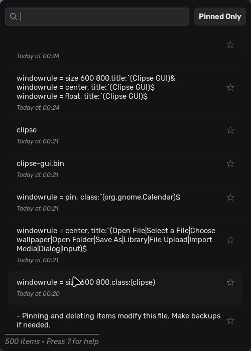
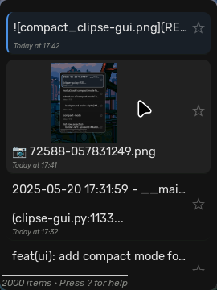

# Clipse GUI

A GTK3 GUI for the [clipse](https://github.com/savedra1/clipse) clipboard manager.

[](https://ko-fi.com/I2I01BJB4B)



<details>
<summary>Compact Mode</summary>



</details>

<details>
<summary>Themes</summary>

<table>
<tr>
<td align="center"><br><sub>Catppuccin Mocha</sub></td>
<td align="center"><br><sub>Nord</sub></td>
<td align="center"><br><sub>Gruvbox Dark</sub></td>
<td align="center"><br><sub>Solarized Light</sub></td>
</tr>
</table>

All themes: [docs/theming.md](docs/theming.md#gallery)

</details>

## Features

- Browse, search, and filter clipboard history
- Pin important items
- Image thumbnails and text preview with zoom
- Keyboard navigation (`?` for shortcuts)
- Compact mode, hover-to-select
- Built-in color themes (Catppuccin, Nord, Gruvbox, Dracula, Tokyo Night, Rosé Pine, Solarized Light, Mono) plus custom CSS — see [Theming](docs/theming.md)
- Multi-select mode
- Auto-paste on Enter (optional)
- System tray with quick-paste menu

## Documentation

Full docs live in [`docs/`](docs/README.md):

- [Installation](docs/installation.md) — dependencies, AUR, source build
- [Getting Started](docs/getting-started.md) — daemon setup, first launch, core workflow
- [Keybindings](docs/keybindings.md) — every shortcut grouped by context
- [Configuration](docs/configuration.md) — every `settings.ini` option explained
- [Theming](docs/theming.md) — colors, radius, CSS customization
- [Tray Integration](docs/tray.md) — tray menu, quick-paste, troubleshooting
- [Window Manager Setup](docs/wm-integration.md) — Hyprland, Sway, Niri, GNOME, KDE, XMonad
- [Troubleshooting](docs/troubleshooting.md) — paste issues, GTK errors, log capture

## Installation

### Arch Linux
```bash
yay -S clipse-gui
```

### From Source
```bash
git clone https://github.com/d7omdev/clipse-gui
cd clipse-gui

just install      # Build and install
just build       # Just build
just run         # Run without installing
just uninstall   # Remove
```

## Requirements

- [clipse](https://github.com/savedra1/clipse) CLI (running with `clipse -listen`)
- GTK3, wl-clipboard, wtype (Wayland) or xdotool (X11)

## Usage

```bash
clipse-gui                     # normal launch
clipse-gui --theme nord        # try a theme for this run
```

### Keyboard Shortcuts

| Key | Action |
|-----|--------|
| `/` or `f` or any letter | Search |
| `Enter` | Copy item (also pastes with `enter_to_paste`) |
| `Shift+Enter` | Copy and paste |
| Click | Copy and paste |
| `Space` | Preview |
| `p` | Pin/unpin |
| `x` or `Delete` | Delete |
| `Tab` | Show pinned only |
| `v` | Multi-select mode |
| `Ctrl+F` | Search in preview |
| `Ctrl+B` | Format JSON in preview |
| `Ctrl++/-/0` | Zoom |
| `?` | Help |

Full list: [docs/keybindings.md](docs/keybindings.md)

### Hyprland
Add to `hyprland.conf`:
```
windowrule = size 600 800,title:(Clipse GUI)
windowrule = center, title:(Clipse GUI)
windowrule = float, title:(Clipse GUI)
```

## Configuration

Settings file: `~/.config/clipse-gui/settings.ini` (created on first run).

### Key Options

```ini
[General]
clipse_dir = ~/.config/clipse        # Clipse history location
enter_to_paste = False              # Auto-paste after copy
compact_mode = False                # Minimal UI
hover_to_select = False             # Select on hover
protect_pinned_items = False        # Prevent deleting pinned

[Style]
theme = catppuccin-mocha            # Built-in or ~/.config/clipse-gui/themes/<name>.css
background_transparent = False      # Let a compositor blur show through

[Commands]
copy_tool_cmd = wl-copy            # Copy command (Wayland)
paste_simulation_cmd_wayland = wtype -M ctrl -P v -p v -m ctrl
```

## Troubleshooting

### No clipboard history
Ensure clipse is running:
```bash
clipse -listen
```

Add to window manager config to start on boot:
```
exec-once = clipse -listen  # Hyprland
```

### Paste not working
- Install `wtype` (Wayland) or `xdotool` (X11)
- Enable `enter_to_paste = True` in settings

## License

MIT - See [LICENSE](LICENSE)

[](https://ko-fi.com/I2I01BJB4B)
