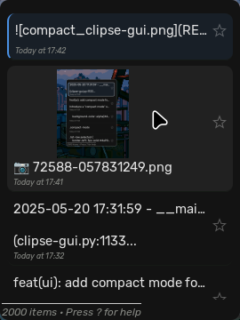

# Clipse GUI

A GTK3 graphical user interface for the excellent [clipse](https://github.com/savedra1/clipse) command-line clipboard manager by savedra1.

This GUI provides a visual way to browse, search, pin, preview, and copy items from your `clipse` clipboard history.


<details>
<summary>Compact Mode</summary>



</details>

## Table of Contents

- [Features](#features)
- [Installation](#installation)
- [Usage](#usage)
- [Configuration](#configuration)
- [Troubleshooting](#troubleshooting)
- [License](#license)

## Features

- **View History:** Browse through text and image entries from your clipboard history file (`clipboard_history.json` by default).
- **Search:** Quickly filter history items using a search bar.
- **Pinning:** Mark important items as "pinned" to keep them visible or filter by them.
- **Preview:** View full text content or larger image previews in a separate window.
  - **Format Text:** Pretty-print JSON or clean up text formatting in preview window (Ctrl+B).
  - **Search in Preview:** Find and highlight text within preview content with match counter and navigation (Ctrl+F).
- **Copy:** Copy any item from the history back to the system clipboard.
- **Compact Mode:** Minimal UI mode with reduced padding, hidden search bar until needed, and denser layout with optimized spacing.
- **Hover to Select:** Automatically select list items when hovering over them with the mouse for faster navigation without clicking.
- **Paste on Enter (Optional):** Configure the application to automatically simulate a paste (Ctrl+V) into the previously focused application after selecting an item with Enter. Requires helper tools (`wtype` for Wayland, `xdotool` for X11).
- **Wayland & X11 Support:** Uses configurable external tools for clipboard interaction, supporting both display server protocols.
- **Lazy Loading:** Loads history items incrementally for better performance with large history files.
- **Configurable:** Customize behavior, commands, and UI elements via an INI configuration file.
- **Image Thumbnails:** Displays image previews directly in the list.

<h1 id="installation">Installation</h1>
<details open>
  <summary>Installation</summary>

### Dependencies

- **Core:**
  - Python 3 (>= 3.7 recommended)
  - GTK+ 3 libraries
  - PyGObject (Python bindings for GTK) - Install using your system's package manager (e.g., `python-gobject` on Arch/Fedora, `python3-gi` on Debian/Ubuntu).
- **Clipboard Copying (Required):**
  - **Wayland:** `wl-copy` (usually part of `wl-clipboard`)
  - **X11:** `xclip`
  - _(The application attempts to use the appropriate tool based on your session type, but you can configure alternatives)_
- **Paste-on-Enter Feature (Optional):**
  - **Wayland:** `wtype`
  - **X11:** `xdotool`
  - _(These tools are only needed if you enable `enter_to_paste = True` in the configuration)_

### Arch Linux (AUR)

An AUR package is available: `clipse-gui`

```bash
# Using yay (or your preferred AUR helper)
yay -S clipse-gui
```

### Manual Installation (Using Makefile)

1.  **Clone the repository:**
    ```bash
    git clone https://github.com/YOUR_USERNAME/clipse-gui.git # Replace with actual repo URL
    cd clipse-gui
    ```
2.  **Install Dependencies:** Ensure you have Python, GTK3, PyGObject, and the required clipboard/paste tools installed (see Dependencies above).
3.  **Build and Install:** The Makefile uses Nuitka to create a distributable binary.
    ```bash
    # Install Nuitka if you don't have it
    # python -m pip install nuitka
    make install
    # This will likely require sudo privileges
    ```
    This command will:
    - Build the application using Nuitka (if not already built).
    - Copy the built application files to `/usr/local/share/clipse-gui`.
    - Create a symbolic link in `/usr/local/bin/clipse-gui`.
    - Install the application icon.
    - Install a `.desktop` file for application launchers.
4.  **Uninstall:**
    ```bash
    make uninstall
    # This will likely require sudo privileges
    ```

### Running from Source (Development / Testing)

1.  **Clone the repository** (if not already done).
2.  **Install Dependencies** (see above).
3.  **Run the script:**
    ```bash
    python clipse-gui.py
    ```
    Or for debugging output:
    ```bash
    python clipse-gui.py --debug
    ```

</details>

## Usage

- **Launch:** Run `clipse-gui` from your terminal or application launcher (if installed).
- **Navigation:** Use `Up`/`Down` arrows, `k`/`j`, `PageUp`/`PageDown`, `Home`/`End` to navigate the list.
- **Search:** Type in the search bar or press `/` or `f` to focus it. Press `Esc` to clear the search.
- **Copy:** Select an item and press `Enter`.
- **Preview:** Select an item and press `Space`.
  - **Format Text in Preview:** Press `Ctrl+B` to pretty-print JSON or clean up text formatting.
  - **Search in Preview:** Press `Ctrl+F` to open search bar with highlighting and match navigation.
- **Pin/Unpin:** Select an item and press `p`.
- **Delete:** Select an item and press `x` or `Delete`.
- **Filter Pinned:** Press `Tab` to toggle showing only pinned items.
- **Zoom:** Use `Ctrl +` / `Ctrl -` / `Ctrl 0` to adjust the main list item size.
- **Settings:** Press `Ctrl+,` to open the settings window for configuring options like compact mode, hover-to-select, and pinned item protection.
- **Help:** Press `?` to view the keyboard shortcuts window.
- **Quit:** Press `Esc` (if search is clear), `Ctrl+Q`.

<details>
<summary><b>Configuration</b></summary>

Clipse GUI uses a configuration file located at:

`~/.config/clipse-gui/settings.ini`

The application automatically creates this file with default settings if it doesn't exist. If new configuration options are added in future updates, they will be automatically added to your existing file while preserving your custom settings the next time you run the application.

You can edit this file manually. Changes require restarting the application to take effect.

### File Format

The configuration file uses the standard INI format, divided into sections (`[SectionName]`).

### Sections and Options

#### `[General]`

| Key                         | Type    | Default Value            | Description                                                                                                                                                      |
| :-------------------------- | :------ | :----------------------- | :--------------------------------------------------------------------------------------------------------------------------------------------------------------- |
| `clipse_dir`                | String  | `~/.config/clipse`       | Path to the directory containing the clipboard history file. `~` is expanded to your home directory.                                                             |
| `history_filename`          | String  | `clipboard_history.json` | Name of the JSON file containing the clipboard history within `clipse_dir`.                                                                                      |
| `enter_to_paste`            | Boolean | `False`                  | If `True`, pressing Enter will copy the item _and_ attempt to simulate a paste (e.g., Ctrl+V). Requires `wtype` (Wayland) or `xdotool` (X11).                    |
| `compact_mode`              | Boolean | `False`                  | If `True`, enables minimal UI mode with reduced padding and hidden search bar until needed.                                                                       |
| `hover_to_select`           | Boolean | `False`                  | If `True`, automatically selects list items when hovering over them with the mouse for faster navigation without clicking.                                        |
| `save_debounce_ms`          | Integer | `300`                    | Delay (in milliseconds) after pinning/deleting an item before the history file is saved to disk.                                                                 |
| `search_debounce_ms`        | Integer | `250`                    | Delay (in milliseconds) after typing in the search bar before the list is filtered.                                                                              |
| `paste_simulation_delay_ms` | Integer | `150`                    | Delay (in milliseconds) after hiding the Clipse GUI window before the paste simulation (if enabled) is triggered. Allows focus to return to the previous window. |

#### `[Commands]`

These define the external command-line tools used for interacting with the system clipboard and simulating paste actions.

| Key                            | Type   | Default Value                         | Description                                                                                        |
| :----------------------------- | :----- | :------------------------------------ | :------------------------------------------------------------------------------------------------- |
| `copy_tool_cmd`                | String | `wl-copy`                             | Command used to **copy** data **to** the clipboard on Wayland sessions.                            |
| `x11_copy_tool_cmd`            | String | `xclip -i -selection clipboard`       | Command used to **copy** data **to** the clipboard on X11 sessions.                                |
| `paste_simulation_cmd_wayland` | String | `wtype -M ctrl -P v -p v -m ctrl`     | Command used to **simulate paste** (e.g., Ctrl+V) on Wayland sessions. Requires `wtype` installed. |
| `paste_simulation_cmd_x11`     | String | `xdotool key --clearmodifiers ctrl+v` | Command used to **simulate paste** (e.g., Ctrl+V) on X11 sessions. Requires `xdotool` installed.   |

#### `[UI]`

| Key                           | Type    | Default Value | Description                                                    |
| :---------------------------- | :------ | :------------ | :------------------------------------------------------------- |
| `default_window_width`        | Integer | `500`         | Initial width of the main application window in pixels.        |
| `default_window_height`       | Integer | `700`         | Initial height of the main application window in pixels.       |
| `default_preview_text_width`  | Integer | `700`         | Default width of the text preview window in pixels.            |
| `default_preview_text_height` | Integer | `550`         | Default height of the text preview window in pixels.           |
| `default_preview_img_width`   | Integer | `400`         | Default width of the image preview window _if loading fails_.  |
| `default_preview_img_height`  | Integer | `200`         | Default height of the image preview window _if loading fails_. |
| `default_help_width`          | Integer | `450`         | Default width of the help window in pixels.                    |
| `default_help_height`         | Integer | `550`         | Default height of the help window in pixels.                   |
| `list_item_image_width`       | Integer | `200`         | Maximum width for image thumbnails in the main list view.      |
| `list_item_image_height`      | Integer | `100`         | Maximum height for image thumbnails in the main list view.     |

#### `[Performance]`

| Key                     | Type    | Default Value | Description                                                                                                |
| :---------------------- | :------ | :------------ | :--------------------------------------------------------------------------------------------------------- |
| `initial_load_count`    | Integer | `30`          | Number of history items to load and display initially when the application starts or filtering changes.    |
| `load_batch_size`       | Integer | `20`          | Number of additional items to load each time you scroll near the bottom of the currently loaded list.      |
| `load_threshold_factor` | Float   | `0.95`        | Scroll position threshold (as a fraction of scrollable height, 0.0-1.0) to trigger loading the next batch. |
| `image_cache_max_size`  | Integer | `50`          | Maximum number of scaled image thumbnails to keep in memory.                                               |

</details>

## Troubleshooting

- **Paste-on-Enter Not Working:**
  - Ensure `enter_to_paste = True` is set in `settings.ini`.
  - Verify that `wtype` (for Wayland) or `xdotool` (for X11) is installed and accessible in your system's PATH.
  - Check the Clipse GUI logs for errors related to the paste command: `~/.config/clipse-gui/clipse-gui.log`. You can run with `clipse-gui --debug` for more verbose logging.
  - Try increasing `paste_simulation_delay_ms` if your system is slow to switch window focus.
- **Cannot Copy/Paste:**
  - Ensure `wl-copy`/`wl-paste` (Wayland) or `xclip` (X11) are installed.
  - Check the configured commands in `settings.ini` under `[Commands]` are correct for your system and installed tools.
  - Check logs (`~/.config/clipse-gui/clipse-gui.log`) for errors related to the copy/paste commands.
- **Configuration Errors on Startup:** If you see a warning dialog about configuration errors, check the log file for details. The application will try to use defaults, and saving the configuration again (e.g., by pinning an item) might fix a corrupted file by overwriting it.

## License

This project is licensed under the MIT License - see the [LICENSE](LICENSE) file for details.
