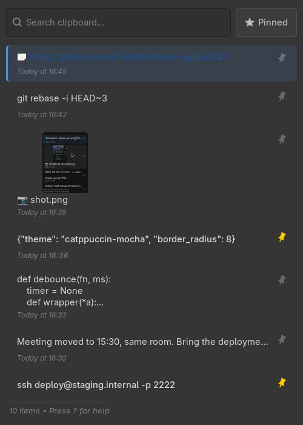
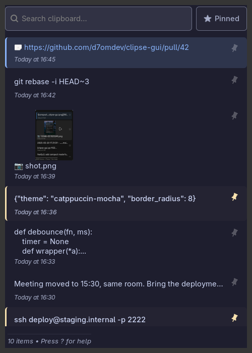
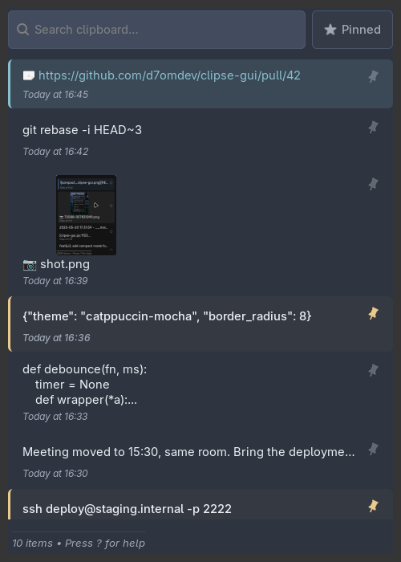
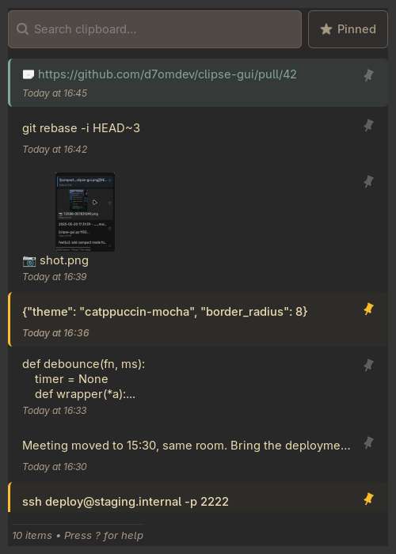
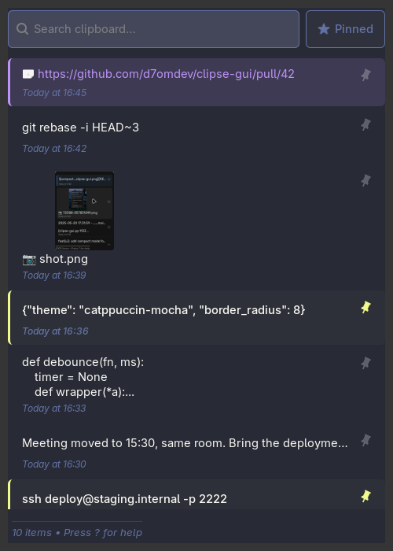
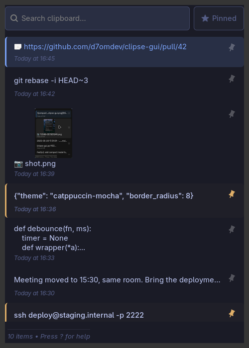
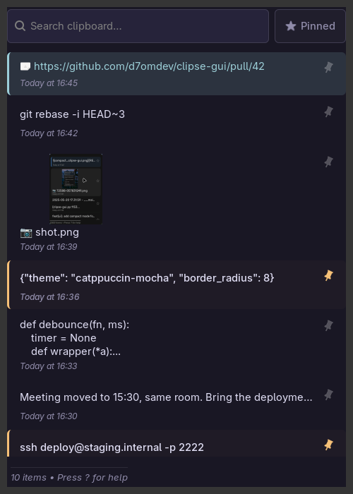
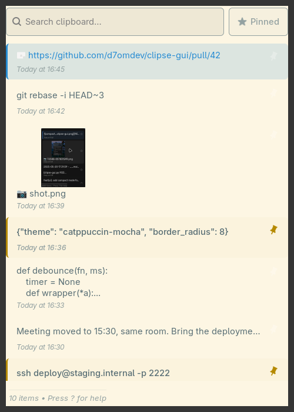
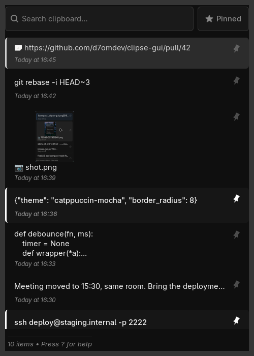

# Theming

Clipse GUI's visual style is driven by a small set of tokens in `[Style]` plus the CSS generator in `clipse_gui/constants.py:get_app_css`. On top of that, a theme file can restyle any window.

## Themes

A theme is a single GTK3 CSS file loaded after the generated CSS. Pick one in Settings → Style → Theme, or set it in `settings.ini`:

```ini
[Style]
theme = name
```

Leave it empty to follow the GTK theme. `clipse-gui --theme NAME` overrides the configured theme for one run without saving it.

Lookup order for `name`:

1. `~/.config/clipse-gui/themes/<name>.css` — your own themes
2. `clipse_gui/themes/<name>.css` — built-in themes shipped with the app

A user file with the same name as a built-in one wins. New files are picked up the next time the Settings window opens.

`~/.config/clipse-gui/custom.css` is always loaded last, regardless of the selected theme, so it is the place for small overrides that should survive switching themes.

Theme changes apply live. Every window carries a class so a theme can target it: `.main-window`, `.settings-window`, `.preview-window`, `.help-window`.

## Gallery

Rendered with the same sample history so the palettes are comparable.

<table>
<tr><td align="center"><br><sub>Default (GTK theme)</sub></td><td align="center"><br><sub>Catppuccin Mocha — <code>theme = catppuccin-mocha</code></sub></td><td align="center"><br><sub>Nord — <code>theme = nord</code></sub></td></tr>
<tr><td align="center"><br><sub>Gruvbox Dark — <code>theme = gruvbox-dark</code></sub></td><td align="center"><br><sub>Dracula — <code>theme = dracula</code></sub></td><td align="center"><br><sub>Tokyo Night — <code>theme = tokyo-night</code></sub></td></tr>
<tr><td align="center"><br><sub>Rose Pine — <code>theme = rose-pine</code></sub></td><td align="center"><br><sub>Solarized Light — <code>theme = solarized-light</code></sub></td><td align="center"><br><sub>Mono — <code>theme = mono</code></sub></td></tr>
</table>

## Settings-Driven Theming

Change these in `~/.config/clipse-gui/settings.ini` or the in-app Settings → Appearance tab.

| Token | Default | Used for |
|-------|---------|----------|
| `border_radius` | `6` | All rounded corners (buttons, rows, switches' tracks use pill regardless) |
| `accent_color` | `#ffcc00` | Pin indicator, pinned row left border, active pin-filter toggle |
| `selection_color` | `#4a90e2` | Selected-row left border, focus rings, switch `on` state |
| `visual_mode_color` | `#9b59b6` | Multi-select mode indicator and selected-in-visual-mode rows |

Colors accept any CSS-recognized format, but stick to `#RRGGBB` for portability.

### Live Reload

Style changes saved via the Settings window regenerate the CSS and reapply immediately — no restart needed. See `StyleMixin.update_style_css` in `clipse_gui/controller_mixins/style_mixin.py`.

## Palette Recipes

### Dark + Warm accent

```ini
border_radius = 10
accent_color = #ff9f43
selection_color = #5b8def
visual_mode_color = #a29bfe
```

### Muted monochrome

```ini
border_radius = 4
accent_color = #e0e0e0
selection_color = #9aa0a6
visual_mode_color = #8e8e8e
```

### High-contrast

```ini
border_radius = 2
accent_color = #ffd600
selection_color = #00e5ff
visual_mode_color = #ff1744
```

## GTK Theme Integration

Clipse GUI respects your system GTK3 theme for:

- Window chrome / titlebar
- Default text color
- Font family and base size

The `[Style]` tokens only override specific semantic surfaces (selection, pinning, multi-select). If your GTK theme already provides a selection color you prefer, set `selection_color` to match it.

## Advanced: Editing the CSS Generator

For structural changes (spacing, shadows, font weights), edit `get_app_css()` in `clipse_gui/constants.py`. The function accepts the four main color tokens plus `border_radius` as parameters, so any changes you make there immediately respond to settings updates.

Key classes you may want to customize:

| Class | What it styles |
|-------|----------------|
| `.list-row` | Each item in the main list |
| `.list-row:hover` | Hover state |
| `.list-row:selected` | Currently focused/selected item |
| `.pinned-row` | Rows with pinned items |
| `.selected-row` | Rows checked in multi-select mode |
| `.pin-icon` | Pin button in each row |
| `.status-label` | Bottom status bar |
| `.key-shortcut` | Key cap styling in help window |
| `.main-window .pin-toggle` | Header "Pinned Only" button |

## What You Cannot Theme (Yet)

- Font family — inherits from GTK
- List row height — driven by compact-mode toggle, not CSS
- Per-item colors — uniform across all items

These are intentional constraints. File an issue if you need them configurable.
